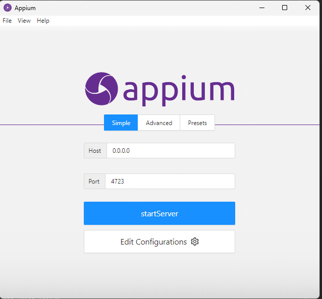
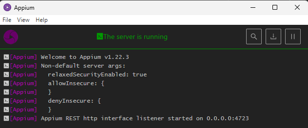
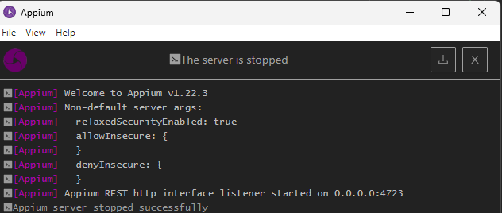

# appium-automation-practice

>The main aim of this tutorial series is to provide the most comprehensive and up-to date articles on how you can 
download and setup Appium from scratch and write your automation test scripts in Java for both mobile apps and mobile browsers.
### Prerequisites
- Windows 10/11 machine with good configuration (minimum 3GB RAM)
- Android Mobile Phone

>Focus mainly on Appium setup for Android

There are two sections:
+ Appium for Mobile apps
+ Appium for Mobile browsers

## I - Appium for Mobile apps
With Appium, you would need to write automation test scripts that interact with the screens and 
controls (buttons, text boxes etc) in your mobile app and perform actions on them. We would use 
Java to write these automation scripts.

### 1. Installation and Setup
- Step 1 - Java installation and setup
  - [x] Download and install Java JDK 
  - [x] Setup Java environment variables
  - Check -> open command prompt and run this command: java -version

- Step 2 - Android Installation and setup
  - [x] Download and install Android Studio - link https://developer.android.com/studio
  - [x] Install additional Android SDK tools - Link https://www.automationtestinghub.com/install-additional-android-sdk-tools/ 
  - [x] Setup Android environment variables
    - To check Android sdk: go to "C:\Users\%USERNAME%\AppData\Local\Android\sdk"
    - At System Variable:
      - Add new with name: ANDROID_HOME - value: C:\Users\%USERNAME%\AppData\Local\Android\Sdk
      - Path: adding
        - %ANDROID_HOME%\platform-tools;
        - %ANDROID_HOME%\tools;
        - %ANDROID_HOME%\tools\bin;
        - %ANDROID_HOME%\cmdline-tools\latest\bin; 
  - Check ->  open command prompt and run this command: sdkmanager – -list
    - Note: work with Java 8 (jdk1.8.0_361)

- Step 3 - Appium tool setup
  
> Appium Desktop is the open-source GUI app that helps you access Appium Server using a graphical interface.
> TO write test scripts with Appium, you need 2 things (and Appium Desktop helps you perform both these tasks)
>- Start the Appium Server
>- Need a mechanism using which you can identify the controls (buttons, text boxes etc) in the mobile app

 - [ ] Download and install Appium Desktop App at https://github.com/appium/appium-desktop/releases

    - Once completed installation, click on startServer button. 
      
      The server is running 
      Click on Stop server button to stop the Appium server
      
 - [ ] Turn On USB Debugging on your Android Device

 - Step 4 - Appium Inspector
   - [ ] Download and install appium inspector
   - [ ] Inspect mobile element using Appium Desktop Inspector
  
## II - Appium for Mobile browsers
Mobile Browser Automation
Learn how to automate test scripts on your mobile browser using Appium.

- Step 1: Setup Appium for Chrome browser automation
- Step 2: First test script to launch Chrome browser on mobile device
- Step 3: Identify Mobile Browser Elements with Appium